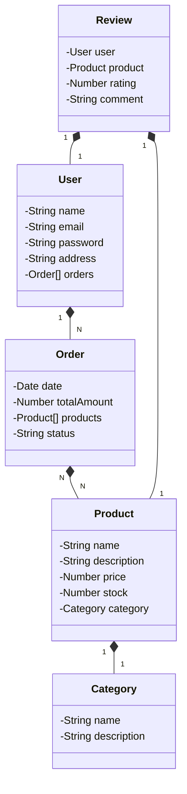

# Java BootCamp Santandar 2024
Java RESTful API criada para o Java BootCamp Santandar 2024

## Diagrama de classes

```mermaid

classDiagram
    class User {
        -String name
        -String email
        -String password
        -String address
        -Order[] orders
    }

    class Product {
        -String name
        -String description
        -Number price
        -Number stock
        -Category category
    }

    class Category {
        -String name
        -String description
    }

    class Order {
        -Date date
        -Number totalAmount
        -Product[] products
        -String status
    }

    class Review {
        -User user
        -Product product
        -Number rating
        -String comment
    }

    User "1" *-- "N" Order
    Product "1" *-- "1" Category
    Order "N" *-- "N" Product
    Review "1" *-- "1" User
    Review "1" *-- "1" Product
```
